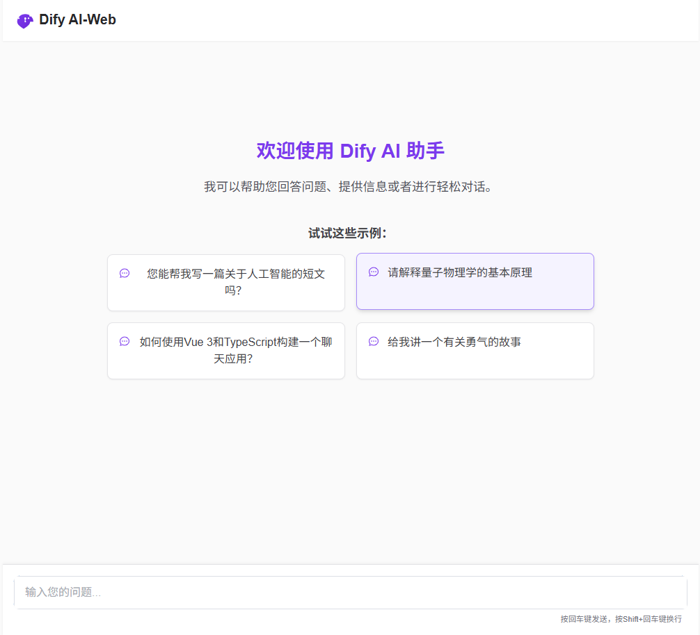
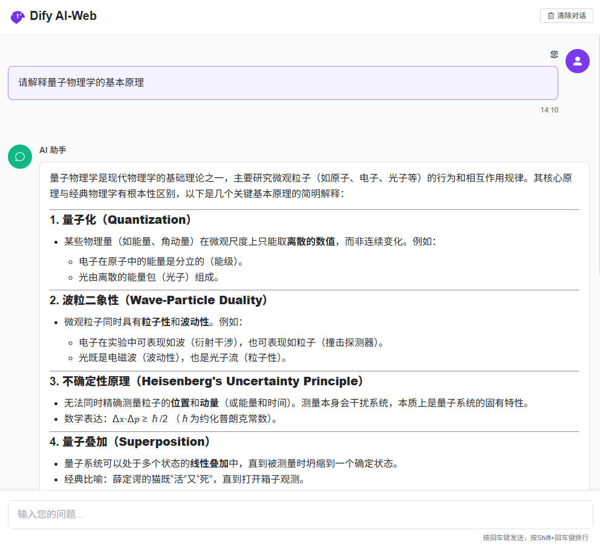
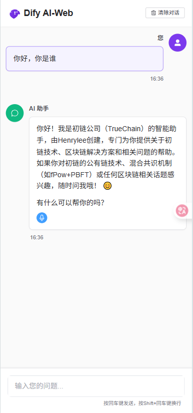

# Dify Chat

- 如果你也对Dify、Rag flow、Coze、RPA、墨刀、workflow等技术感兴趣，欢迎一起交流学习，开发该项目。
- 基于 Vue 3、TypeScript 和 Element Plus 构建的现代化 Dify AI 聊天界面。
- 作者: [liheng-Henrylee](https://github.com/airleeq)
- 联系微信: Airlee1025
- 如果你有开发基础和新的想法，加我给你仓库权限上传代码，一起持续改进这个项目
- 该项目支持界面自适应web端和手机端，并且支持实时流式聊天响应、Markdown支持（TODO：代码高亮）。

web端截图：


web端对话截图：


手机端截图：

          


## 功能特点
- vercle自动化部署
- 实时流式聊天响应
- 文字转语音(Dify支持多种音色选择)
- Markdown 支持（包含代码高亮）
- 双端响应式界面
- 清晰的对话历史记录

## 开始使用

### 环境要求

- Node.js 16+
- npm 或 yarn

### 安装步骤

1. 克隆仓库

```bash
git clone https://github.com/LeeAirQ/Dify-Web.git
cd dify-chat
```

2. 安装依赖

```bash
npm install
```

3. 配置

应用默认配置为连接到 `http://localhost/v1` 的 Dify 后端，API 令牌为 `app-xxxxxxxxxxxxxxxxxxx`。

如需修改这些设置，请更新 `src/api/chat.ts` 中的 API 配置。

4. 启动开发服务器

```bash
npm run dev
```

### 生产环境构建

```bash
npm run build
```
如果你想要部署上线，把.env环境变量中加入你自己的dify服务器地址以及api即可完成快速的vercel自动化部署。

## 项目结构

- `src/api` - API 服务和接口
- `src/components` - 可复用的 Vue 组件
- `src/stores` - Pinia 状态管理
- `src/views` - 主应用视图

## 技术栈

- Vue 3 (使用 Composition API)
- TypeScript
- Pinia 状态管理
- Element Plus UI 组件库
- Marked (用于 Markdown 渲染)
